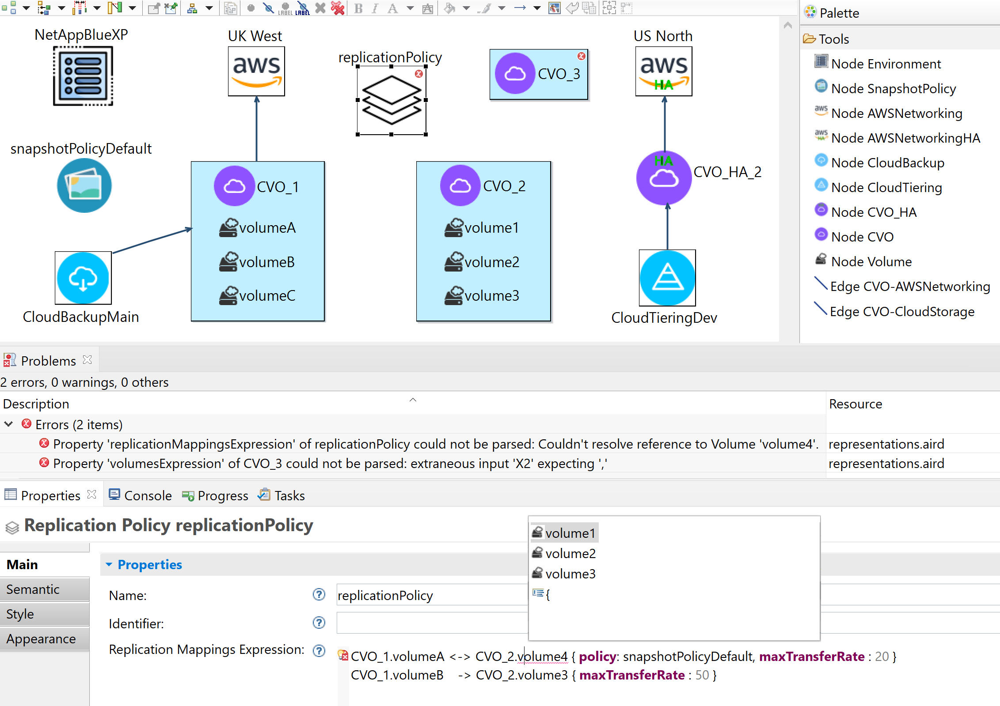

## Cloud Services DSL

The DSL's metamodel defines NetApp cloud services and infrastructure components that are deployed to the cloud using  a *Deployment* configuration, into an *Environment*  (e.g., [NetApp BlueXP](https://www.netapp.com/bluexp)), in a specific public cloud (*AWS* is currently supported). Examples of cloud services and infrastructure components include *Cloud Volumes ONTAP (CVO)*, *SnapMirror*, *SnapshotPolicy*, *ReplicationPolicy*, *CloudBackup* and *CloudTiering*, among others.

The following figure presents the hybrid graphical-textual DSL editor that has been developed for the DSL by leveraging Graphite. The majority of the NetApp cloud services and infrastructure components are represented with a graphical syntax, i.e., *CVO*, *SnapshotPolicy*, *CloudBackup*, *CloudTiering*, *AWSNetworking* and *Environment*. However, the *replication mappings* of a *ReplicationPolicy* are better suited to be represented using textual expressions. In the figure, the textual editor of the property *Replication Mappings Expression* is an embedded Xtext editor with assistance features. The first line specifies a bidirectional replication, whereas the second line specifies a unidirectional replication. The second line states that *volumeB* from *CVO_1* must be replicated into *volume3* from *CVO_2* with a *maximum transfer rate* of 50 mebibytes per second. Additionally, a JSON-like textual syntax was used to define the *volumes* of *CVO* instances. In this case, the *volumes* can be defined graphically, but also textually.

