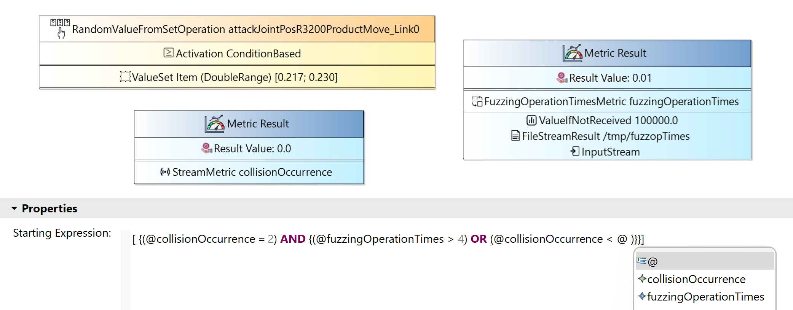

## Fuzzing-based Testing DSL

The DSL enables the definition of testing specifications of robotic systems in simulation. The core meta-classes are *TestingSpace*, *TestCampaign* and *Test*. A *TestingSpace* represents the root element of the domain and comprises permissible fuzzing operations that bind the potential fuzzing space. The testing space also includes performance *metrics*, which are used to quantify the robotic system performance for safety violations. A *TestCampaign* specifies and constrains an individual experiment, referencing from the *TestingSpace* a subset of *metrics* to use in campaign evaluation, together with a subset of chosen fuzzing operations. The *FuzzingOperation* class is a specific fuzzing operation, i.e., an entity that represents a specific strategy for making runtime modifications to the multi-robot system (MRS). The *Test* class represents a test configuration, corresponding to a specific selection of *fuzzing operations*. During *Test* execution, instances of *MetricInstance* are recorded, to quantify the values of particular *Metric*s under the applied fuzzing. The DSL uses condition-based fuzzing. Condition-based fuzzing allows users to activate and deactivate fuzzing based on custom scenario-specific events, incorporating complex logic and spatial or geometric properties.

The following figure depicts the hybrid graphical-textual DSL editor of the Fuzzing-based Testing DSL. The hybrid DSL editor presents a *Test* execution, displaying graphically the *fuzzing operation* used and the *result metrics* of activating this fuzzing operation when applying the *condition-based activation* specified in the smart textual editor.

<table>
  <tr>
    <td></td>
  </tr>
</table>
