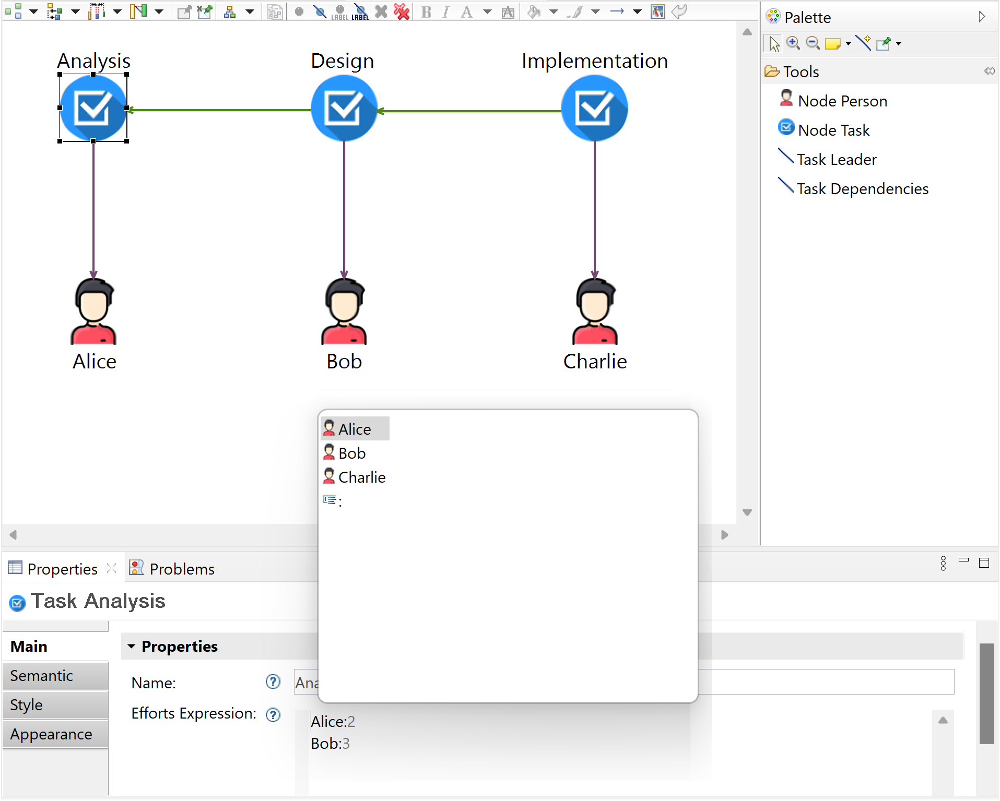

## Project Scheduling DSL

The DSL is used for scheduling and managing projects. The DSL's metamodel specifies that a *Project* contains a list of *tasks* and a list of *people*. A *Task* has a *name* and a list of *efforts*. Each *Effort* is assigned to a *person* and has a number of *months*. For the purpose of this example, it is preferred to use a textual syntax for specifying the *efforts*.

The following figure displays a modeled *project* in a hybrid graphical-textual DSL editor, in which the *tasks* and the *people* are modeled graphically, whereas the *efforts* are expressed with a YAML-like textual syntax, for which each *effort* is specified on a separate line, as a key-value pair in the form `{person}:{months}`. Therefore, the *tasks* and the *people* model elements represent the graphical parts of the model, whereas the *efforts* represent the textual parts of the model. The *task* named *Analysis* is selected in the diagram, therefore its properties (i.e., the *name* and the *efforts*) are displayed in the properties view. Each line from the *efforts* textual expression represents an *effort* model element, e.g., the first line is an *effort* that refers to a *person* named *Alice* and has a value of 2 *months*.

