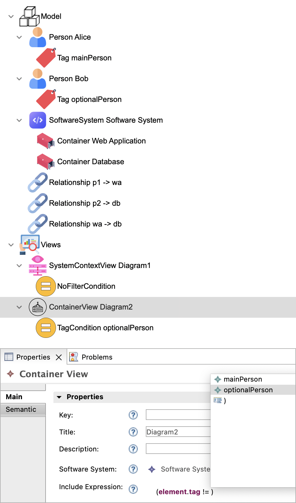

## Structurizr DSL

The DSL's metamodel has been defined by mimicking the official language reference of [Structurizr](https://docs.structurizr.com/dsl/language). The metamodel specifies that *Workspace* is the top-level language construct, containing the *model* and *views* properties. A *Model* contains a *softwareSystem*, a list of *persons*, and a list of *relationships* between elements. A *C4Element* has an *identifier*, a *name*, a *description*, an *url*, a list of *relationships*, a list of *tags*, a list of *properties* and a list of *perspectives*. A *Relationship* is represented as an edge from a *source* to a *target* *C4Element*, that has a *description*, among others. A *Tag* has a *name*. *Person* and *Container* are subtypes of *C4Element*. Moreover, a *SoftwareSystem* is a *C4Element* that stores a list of *containers*. The *Views* metaclass contains a list of *viewElements* that represent different types of diagrams, and additionally, contains a list of *styles* that specify how the diagrams should be styled. *SystemContextView* and *ContainerView* are subtypes of *ViewElement*. A *SystemContextView* represents a System Context (level 1) diagram, that references a *softwareSystem* and contains an *include* element of type *ConditionElement*, that specifies which *C4Element* model elements should be included in the diagram.

The following figure presents the hybrid graphical-textual DSL editor of the Structurizr DSL. The hybrid DSL editor operates over a C4 semantic model containing *persons*, *tags*, *relationships*, *containers*, *views* and a *software system*. All metamodel properties except *includeExpression* are modelled graphically within the hybrid DSL editor. The *include* textual expression is specified in a smart textual editor that benefits from syntax-aware editing features, such as syntax highlighting, code completion and error markers. An auto-completion pop-up menu is shown, listing all *Tag* elements that can be referenced in that context (i.e., *mainPerson* and *optionalPerson*).

<table>
  <tr>
    <td></td>
  </tr>
</table>
